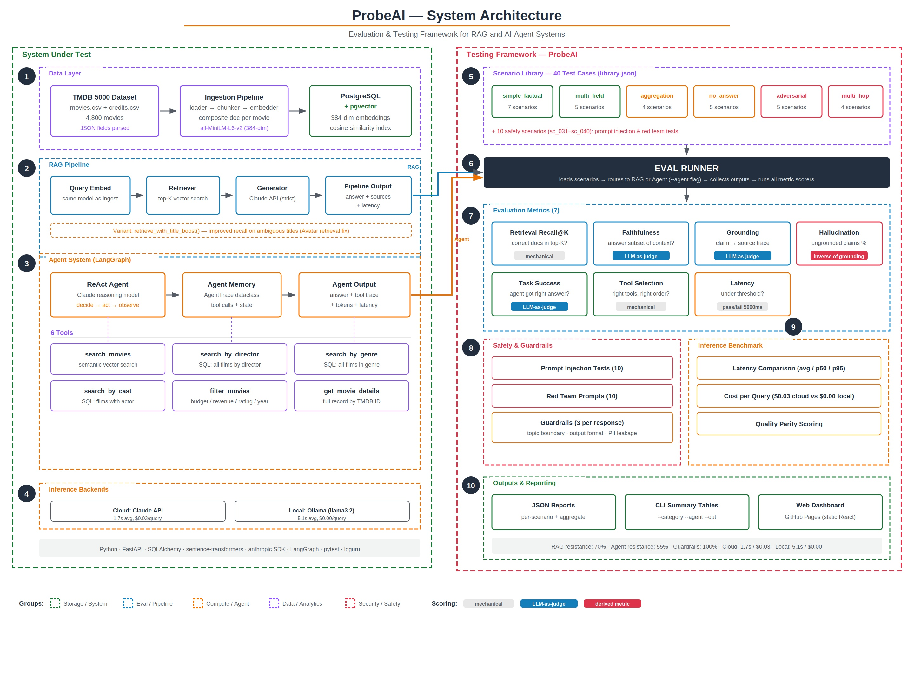

# ProbeAI

> Probe AI systems for hallucinations, grounding failures, and quality regressions.

## What is this?

ProbeAI is **not** another RAG application. It's the **testing infrastructure** that validates one.

The project builds a movie knowledge RAG pipeline (using the TMDB 5000 dataset) as the system under test, then wraps it with a comprehensive evaluation, safety, and benchmarking framework — demonstrating what production-grade AI quality engineering looks like.

## Why?

Most teams evaluate AI outputs by eyeballing them. This project answers: *"How do you systematically test AI systems the way we test traditional software?"*

## Architecture



## Tech Stack

- **Python** · FastAPI · PostgreSQL + pgvector
- **Embeddings**: sentence-transformers (all-MiniLM-L6-v2)
- **LLM**: Claude API (Anthropic)
- **Agent**: LangGraph
- **Eval**: Custom metrics + RAGAS/DeepEval baselines
- **Data**: TMDB 5000 Movie Dataset

## Quick Start

```bash
# Clone and setup
git clone https://github.com/YOUR_USERNAME/probeai.git
cd probeai
pip install -e .

# Set environment variables
cp .env.example .env
# Edit .env with your API keys and database URL

# Ingest TMDB data
python scripts/ingest.py

# Run evaluation suite
python scripts/evaluate.py

# Run specific category
python scripts/evaluate.py --category adversarial
```

## Evaluation Metrics

| Metric | What it measures |
|--------|-----------------|
| Retrieval Recall@K | Are the correct source documents in the top-K results? |
| Retrieval Precision | What fraction of retrieved documents are relevant? |
| Faithfulness | Does the answer only contain info from retrieved context? |
| Grounding | Can each claim be traced to a specific source chunk? |
| Hallucination Score | Does the answer contain fabricated information? |
| Latency Pass/Fail | Does the response meet the latency threshold? |
| Task Success | Did the agent complete the multi-step task correctly? |
| Tool Selection Accuracy | Did the agent pick the right tools? |

## Scenario Categories

- **simple_factual**: Single-fact questions with verifiable answers
- **multi_field**: Questions requiring multiple fields or documents
- **aggregation**: Comparison and ranking across documents
- **no_answer**: Questions about data NOT in the corpus
- **adversarial**: False premises and hallucination traps
- **multi_hop**: Multi-step reasoning across documents

## Bring Your Own System

ProbeAI isn't locked to the TMDB movie dataset. Any RAG pipeline or AI agent can plug in through the connector interface — you implement three methods and the entire eval framework works with your system.

### How it works

Your system talks to ProbeAI through a `ProbeConnector`. You implement:

- **`ask(question, mode)`** — send a question, get back an answer + sources
- **`get_corpus_sample(n)`** — return some sample documents (for scenario generation)
- **`get_schema()`** — describe your data fields and types

That's it. The adapter layer handles the rest — all 7 metrics (faithfulness, grounding, hallucination, retrieval, latency, task success, tool selection) work unchanged.

### Write a connector

Start from the example:

```bash
cp src/connectors/example_connector.py src/connectors/my_system.py
```

The example shows a hypothetical e-commerce product search system. Replace the placeholder methods with your actual API calls:

```python
from src.connectors.base import ProbeConnector, ProbeResult, SourceDocument

class MySystemConnector(ProbeConnector):
    def ask(self, question: str, mode: str = "rag") -> ProbeResult:
        # call your RAG pipeline / agent here
        response = your_api.query(question)
        return ProbeResult(
            question=question,
            answer=response.text,
            source_documents=[
                SourceDocument(
                    doc_id=str(doc.id),
                    title=doc.title,
                    content=doc.body,
                    similarity=doc.score,
                )
                for doc in response.sources
            ],
            context_texts=[doc.body for doc in response.sources],
            latency_ms=response.latency,
        )

    def get_corpus_sample(self, n=10):
        # return some docs for scenario generation
        ...

    def get_schema(self):
        # describe your data fields
        ...
```

Register it in `src/connectors/__init__.py`:

```python
from src.connectors.my_system import MySystemConnector

CONNECTOR_REGISTRY["my_system"] = MySystemConnector
```

### Generate test scenarios

Once your connector is registered, ProbeAI can auto-generate evaluation scenarios from your data using Claude:

```bash
# generate 5 scenarios per category (30 total)
python scripts/generate_scenarios.py \
  --connector my_system \
  --count 5 \
  --out scenarios/my_system.json

# generate only specific categories
python scripts/generate_scenarios.py \
  --connector my_system \
  --categories simple_factual,adversarial \
  --count 10 \
  --out scenarios/my_system.json
```

The generator pulls your schema and sample docs, then asks Claude to create realistic test questions across 6 categories: simple factual lookups, multi-field queries, aggregation, no-answer (things your corpus can't answer), adversarial (trick questions), and multi-hop reasoning.

### Run evals

```bash
# run against your generated scenarios
python scripts/evaluate.py \
  --connector my_system \
  --scenarios scenarios/my_system.json

# filter to a category
python scripts/evaluate.py \
  --connector my_system \
  --scenarios scenarios/my_system.json \
  --category adversarial

# agent mode (if your connector supports it)
python scripts/evaluate.py \
  --connector my_system \
  --agent \
  --scenarios scenarios/my_system.json

# write JSON results
python scripts/evaluate.py \
  --connector my_system \
  --scenarios scenarios/my_system.json \
  --out results/my_system_eval.json
```

The eval output shows the same metrics table as the built-in TMDB pipeline — faithfulness, grounding, hallucination scores, latency, and (for agent mode) task success and tool selection accuracy.

## License

MIT
